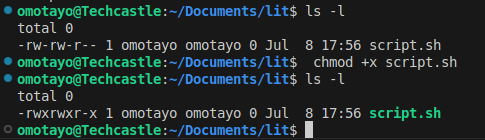
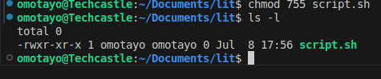
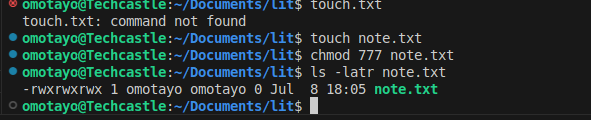
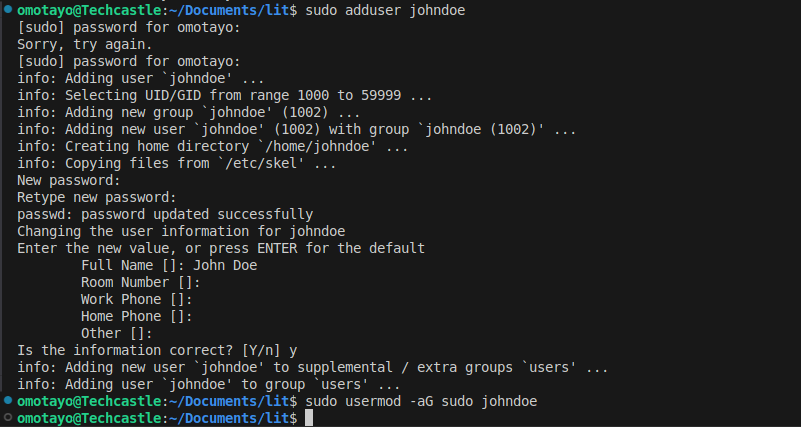
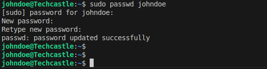
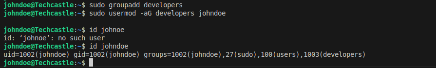
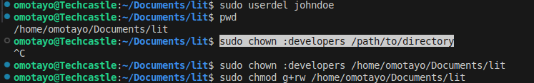

# ad_linux

## crating the script.sh file

## Editing the file persion 

## Editing the Permission using chmod (755 script.sh)

## Using another example 

# User Managemnet on Linux

## Creating User John Doe and giving administrative priviledges 

## Password change for JohnDoe

## Group Creation and verification

## User deletion and Permission

